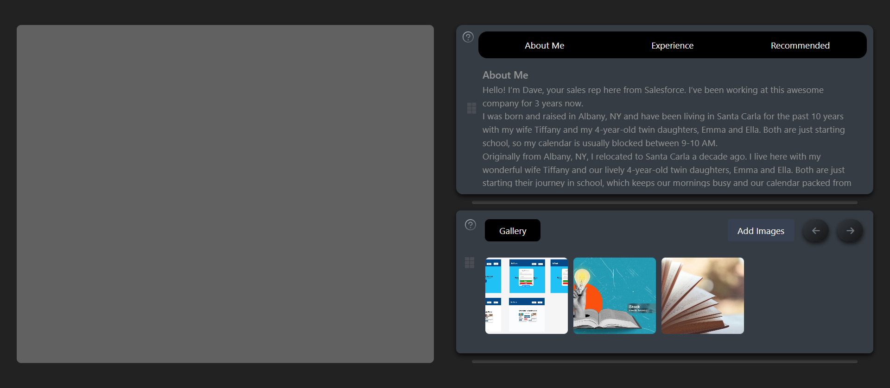

# React Portfolio Application

This is a React-based portfolio web application that allows users to display sections about themselves, their experiences, and recommendations. It also features an interactive image gallery that lets users upload, view, and navigate through images.

## Table of Contents
1. Features
2. Technologies Used
3. Installation
4. Usage
5. Screenshots

### Features

1. Dynamic navigation between multiple sections: About Me, Experience, and Recommended.
2. A customizable image gallery that supports file uploads, image preview, and navigation through images.
3. LocalStorage support to save and persist uploaded images across sessions.
Simple and clean UI using TailwindCSS.

### Technologies Used
1.React.js (Functional components with hooks)
2.TailwindCSS for styling

### Installation
 1. Clone the repository
 git clone https://github.com/adminkhush/Lunacal-assignment.git
2. Navigate into the project directory:
   cd Lunacal-assignment

3. Install the dependencies:

npm install
npm install -D tailwindcss postcss autoprefixer
npx tailwindcss init -p
npm start

### USAGE
1. Navigate between different sections (About Me, Experience, and Recommended) using the navigation buttons at the top.
2. In the Gallery section:
   1. Click Gallery to show the image gallery.
   2. Upload images by clicking on the file input.
   3. Use the Prev and Next buttons to navigate through the images.
   4. The Back button hides the gallery and returns you to the main content.
4. Gallery Features
   1. Upload Images: Users can upload images by selecting a file through the input form.
   2. Navigate Images: Navigate through the uploaded images using the "Prev" and "Next" buttons.
   3. Gallery Visibility: The navigation buttons disappear when there is only one     image     uploaded and reappear when there are multiple images.
   4. Local Storage: Uploaded images are saved to LocalStorage and persist across sessions.

### Screenshots

